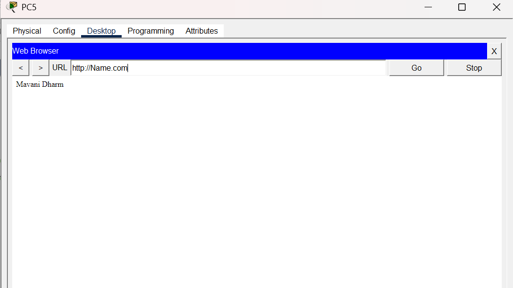

# DNS Server Configuration – Cisco Packet Tracer

## 📌 Project Overview

This project demonstrates the configuration and working of a **DNS (Domain Name System) Server** using Cisco Packet Tracer.

The main purpose of this project is to configure a DNS server that converts a domain name into an IP address, allowing users to access a web server using a domain name instead of directly entering the IP address.

---

## 🖥️ Network Topology



---

## 🔧 Devices Used

- 1 × Router
- 4 × Cisco 2960 Switches
- 9 × PCs
- 1 × Server
- Ethernet cables

---

## 🌐 Network Configuration

### Router

- IP Address: `192.168.1.254`
- Subnet Mask: `255.255.255.0`

### DNS / Web Server

- IP Address: `192.168.1.1`
- Subnet Mask: `255.255.255.0`
- Gateway: `192.168.1.254`

### PCs

All PCs are configured in the same network:

`192.168.1.0/24`

Example:

- PC0 → `192.168.1.2`
- PC1 → `192.168.1.3`
- PC2 → `192.168.1.4`

---

## 🌍 DNS Configuration

The server is configured with:

- DNS Service: **ON**
- HTTP Service: **ON**
- Domain Name: `Name.com`
- DNS Record:

```text
Name.com → 192.168.1.1
